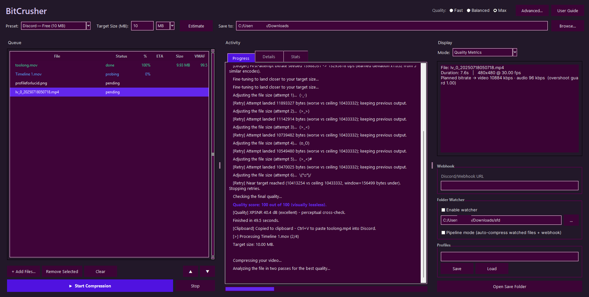

# BitCrusher

Compresses video, audio, images, and PDFs down to a target size — a ceiling
it aims for but never overshoots. Built for upload limits like Discord's
10/25/50MB caps. Runs as a desktop GUI or a CLI, and learns from its own
past encodes to make better first-attempt decisions over time.

> **Requires Python 3.10+ on your PATH.** Get it from
> [python.org/downloads](https://www.python.org/downloads/) — check
> "Add python.exe to PATH" during install. `BitCrusher.bat` will tell you
> if it's missing.



## Features

- Video, audio, image, and PDF compression in one queue, routed automatically.
- Measured codec race: your requested encoder vs AV1, picked by actual VMAF.
- Two-pass rate control, per-scene bitrate zones, artifact-aware prefiltering.
- Trim-aware compression, folder watcher, Explorer "Send to", Discord webhook.
- A learning system that seeds future encodes from measured past outcomes.
- Fully offline core — no data leaves your machine during a compression job.
- Opt-in update check against GitHub Releases (asked once on first launch,
  toggle any time in Settings > Check for Updates).
- Advanced Options > Export Sanitized Logs makes a redacted copy of the
  learning ledger, recent job logs, and settings — safe to paste into a bug
  report (strips your home path and any saved webhook URL).

## Benchmark

Real CLI runs, not cherry-picked — reproduce with
`python BitCrusherV9.py <file> -t <MB> --quality max` (video) or
`... -t <MB> --audio-format opus` (audio). All on CPU only, no hardware
acceleration.

| Source | Target | Result | Quality |
|---|---|---|---|
| 4K video, 14.01s @ 29.97fps, H.264, 39.40 MB (23.6 Mbps), high-motion/low-complexity stock clip | 10 MB | AV1 3840x2160, 9.85 MB (25.0% of source), two-pass, 357s | VMAF 86.9 mean / **85.5 worst-scene** @ 0:04, XPSNR 42.3 dB |
| same 4K source | 5 MB | AV1 **downscaled to 1920x1080**, 4.95 MB (12.6% of source), two-pass, 137s | VMAF 74.4 mean / **71.5 worst-scene** @ 0:04, XPSNR 39.1 dB |
| Commercial FLAC track, 4:33, 44.1kHz stereo, 30.40 MB (933 kbps), embedded cover art | 8 MB | Opus ~234 kbps, 7.85 MB (25.8% of source), 2s, cover art preserved | "transparent (perceptually lossless)" |
| Casual clip, 1:56 @ 30fps, 848x464, H.264, 19.93 MB (1.4 Mbps), low source bitrate | 10 MB | AV1 848x464, 9.94 MB (49.9% of source), two-pass, 259s | VMAF 98.7 mean / **94.6 worst-scene** @ 1:53, XPSNR 37.3 dB |
| Phone-shot vertical clip, 1:07 @ 30fps, 720x1280, H.264, 33.83 MB (4.2 Mbps) | 10 MB | AV1 720x1280, 9.85 MB (29.1% of source), two-pass, 445s | VMAF 99.6 mean / **95.6 worst-scene** @ 1:03, XPSNR 40.1 dB |
| Concert video, 4:18 @ 30fps, 1280x720, H.264, 80.43 MB (2.6 Mbps), low-light/high-motion crowd footage | 10 MB | AV1 1280x720, 9.86 MB (**12.3% of source, ~8x**), two-pass, 517s | VMAF 90.2 mean / **82.9 worst-scene** @ 1:38, XPSNR 40.5 dB |

**Why these numbers are good, at a glance:**

- **Bolded worst-scene, not mean.** That's the actual floor the pipeline
  optimizes for — a good average can hide one ugly scene, worst-scene
  can't. 70-95 worst-scene across the table means no hidden bad frame.
- **Hits the cap without going over.** Every row lands *under* its target
  (9.85-9.94 MB against 10 MB caps) — it's a ceiling, never an overshoot.
- **Downscales on purpose, not by accident.** Rows 1-2 are the same 4K
  clip: at 10 MB it keeps full 4K, at 5 MB it drops to 1080p — trading
  resolution for bitrate instead of starving 4K into mush.
- **Picks the winning codec for you.** Every video row measured AV1
  beating the requested x264 on actual VMAF-per-bit and switched
  automatically — you don't have to already know AV1 is the right call.
- **Ordinary files, not cherry-picked test clips.** The last three rows
  are real phone/screen-capture footage. The concert video is the hard
  case — low-light, high-motion crowd footage compressed **~8x** — and
  still lands "excellent" (VMAF 90.2, worst-scene 82.9).

On the codec race: both video rows measured av1 beating the requested
x264 on VMAF-per-bit (e.g. the 10 MB run: av1=87.1 vs x265=82.2 vs
x264=71.3 on probe segments) and switched automatically.

## Requirements

- Windows, [Python 3.10+](https://www.python.org/downloads/)
- ffmpeg, ffprobe, and HandBrakeCLI — either on `PATH`, or dropped into a
  `tools/` folder next to `BitCrusherV9.py`. Configure custom paths in the
  app (Settings > Configure Paths) or with the `BC_FFMPEG`/`BC_FFPROBE`
  env vars.

## Install

```
pip install -r requirements.txt
```

## Run

Double-click `BitCrusher.bat` to launch the GUI, or use it from a terminal for CLI mode:

```
BitCrusher.bat                          # GUI
BitCrusher.bat clip.mp4 -t 8            # CLI — any argument switches to CLI mode
```

Or run the script directly:

```
python BitCrusherV9.py                  # GUI
python BitCrusherV9.py clip.mp4 -t 8    # CLI — any argument switches to CLI mode
```

## Docs

- [User Guide](docs/USER_GUIDE.md) — GUI walkthrough.
- [CLI_COMMANDS.md](CLI_COMMANDS.md) — full flag reference.

## License

GNU General Public License v3.0 or later. See [LICENSE.md](LICENSE.md).

Copyright (C) 2026 AzureShores

This program is free software: you can redistribute it and/or modify
it under the terms of the GNU General Public License as published by
the Free Software Foundation, either version 3 of the License, or
(at your option) any later version.

This program is distributed in the hope that it will be useful,
but WITHOUT ANY WARRANTY; without even the implied warranty of
MERCHANTABILITY or FITNESS FOR A PARTICULAR PURPOSE. See the
GNU General Public License for more details.
